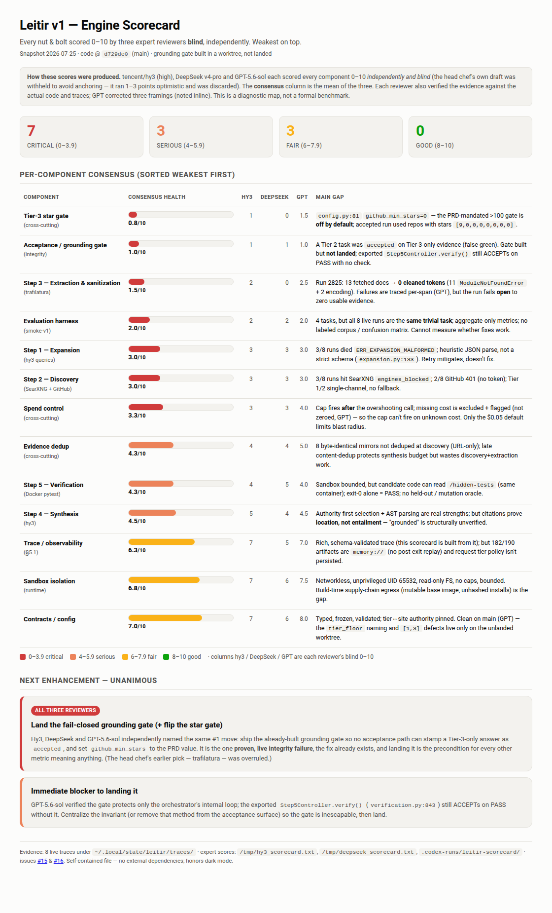

# Leitir

Leitir is a prototype technical-search and Python code-synthesis orchestrator.
It expands a programming task into searches, collects and sanitizes evidence,
asks `tencent/hy3` to synthesize code through OpenRouter, and runs that code
with `pytest` in an isolated Docker container.

**Status: prototype / design-stage. Leitir v1 is not production-ready.**

## Shipped v1 boundaries

The implementation is deliberately narrower than parts of the PRD:

- Python tasks only.
- Evidence Tiers 1–3 only; there is no headless-browser Tier 4.
- The Docker sandbox runs `pytest` only; it does not run Cargo or Go.
- The bundled smoke evaluation has four tasks (the supported smoke boundary is
  3–5), not the planned 50-task benchmark.
- Tracing is structured JSON only. OpenTelemetry export is deferred.
- The workflow makes **zero internal Hy3 review calls**. A review-purpose
  client method exists, but the v1 loop does not use it.

Leitir, the `tencent/hy3` model, and the OpenRouter provider are separate
components. See [the PRD](docs/PRD.md) for the broader design; shipped behavior
is described here and in the [operator guide](docs/operations.md).

## How v1 works

1. **Query expansion:** Hy3 produces site-restricted queries for Tiers 1–3.
2. **Discovery:** local, unauthenticated SearXNG serves documentation searches;
   anonymous GitHub Code Search serves code searches.
3. **Extraction:** Leitir fetches, cleans, deduplicates, and screens untrusted
   retrieved content. Tier 3 repositories must have more than 100 stars.
4. **Synthesis:** Hy3 produces a Python candidate grounded in selected evidence.
5. **Verification:** a networkless, ephemeral Docker container runs `pytest`.
   Syntax and logic failures can trigger at most three repairs (four total
   candidate attempts). Missing or stale evidence routes back through search.

Tier 1 official provider contracts outrank Tier 2 canonical Python/package
documentation, which outranks Tier 3 GitHub implementation examples. Lower
tiers may add detail but do not override a conflicting higher-tier contract.

## Engine health scorecard

`docs/leitir-engine-scorecard.html` scores every component of the v1 engine —
the five pipeline steps plus cross-cutting concerns (extraction, dedup, the
acceptance gate, sandbox, spend, trace, evaluation) — on a 0–10 health scale,
weakest first. **The scores are the blind consensus of three independent expert
reviewers (tencent/hy3, DeepSeek v4-pro, GPT-5.6-sol)**, each scoring every
component from the live run traces and the codebase; an earlier head-chef draft
ran optimistic and was discarded. Open the HTML for the full per-reviewer
breakdown; the image below is a static snapshot.



**How to read it.** Bar length is the consensus health score (0–10); color is
the band — red 0–3.9 (critical), orange 4–5.9 (serious), amber 6–7.9 (fair),
green 8–10 (good). On this snapshot 7 of 13 components score critical and none
score good: the acceptance/gate and the Tier-3 star gate are the weakest bolts,
and all three reviewers agree the highest-leverage next step is to land the
already-built fail-closed grounding gate. This is a diagnostic map, not a formal
benchmark.

## Prerequisites

- Python 3.11 or newer
- A running Docker daemon accessible to the current user
- Network access for OpenRouter, SearXNG, GitHub, raw source, and initial Docker
  image/dependency builds
- An unauthenticated SearXNG JSON endpoint at
  `http://localhost:8080/search`
- An OpenRouter key in the one supported credential file (described below)

GitHub access is anonymous in v1; there is no GitHub credential option, so API
rate limits apply.

## Install

From a clean checkout, use the fully pinned runtime, test, and build closure:

```bash
python -m venv .venv
. .venv/bin/activate
python -m pip install -r requirements.txt
python -m pip install --no-build-isolation --no-deps -e .
leitir --help
```

The `[project.scripts]` entry in `pyproject.toml` installs the `leitir` console
script. The install and help commands above have been verified against this
checkout.

## Credential setup

Leitir reads a key **only** from the `openrouter` object in:

```text
~/.local/share/opencode/auth.json
```

That object must contain one of `key`, `apiKey`, or `api_key`. If multiple
aliases are present, their values must agree. A shape-only example is:

```json
{"openrouter":{"key":"REDACTED"}}
```

Do not put a real key in a task, command line, issue, trace, or log. Keep the
auth file out of source control and restrict its file permissions. The key is
used as a Bearer credential and is never intentionally logged or serialized.
Leitir does not read an OpenRouter key from an environment variable.

## Quick start

Running a task performs network calls, paid model calls, and Docker execution:

```bash
leitir run --task "Write a Python function that preserves repeated query parameters" --language python
```

`--language` defaults to `python`, so it may be omitted. A completed run prints
one line such as:

```text
status=accepted trace=/home/user/.local/state/leitir/traces/TRACE.json
```

The trace is written for every completed orchestrator run, including task
failure, repair exhaustion, cancellation, infrastructure failure, and spend-cap
termination. The default per-run cap is USD 0.05.

The CLI has no dry-run or fixture flag. Safe, offline checks are:

```bash
leitir --help
leitir run --help
leitir eval --help
python -m pytest --ignore=tests/test_verification_docker.py
```

`leitir eval` is separately gated and refuses paid execution unless
`LEITIR_ENABLE_LIVE_EVAL=1` is set. See
[Smoke evaluation](docs/smoke-evaluation.md).

## Tests and operator documentation

```bash
python -m pytest
```

The test suite uses injected fakes for network/model behavior and does not need
a real credential. The full suite includes Docker sandbox integration tests
and therefore requires the Docker daemon. For a Docker-free check, add
`--ignore=tests/test_verification_docker.py`.

- [Operations, CLI outcomes, traces, security, and troubleshooting](docs/operations.md)
- [Smoke evaluation and metric definitions](docs/smoke-evaluation.md)
- [Product Requirements Document](docs/PRD.md)
- [Engine health scorecard](docs/leitir-engine-scorecard.html) — per-component 0–10 health (3-expert consensus)

## Repository layout

- `src/leitir/` — shipped Python package
- `src/leitir/benchmarks/smoke-v1/` — versioned four-task smoke benchmark
- `tests/` — fake-backed tests plus live Docker sandbox integration tests
- `requirements.txt` — exact dependency lock
- `pyproject.toml` — package metadata and `leitir` console entry point
