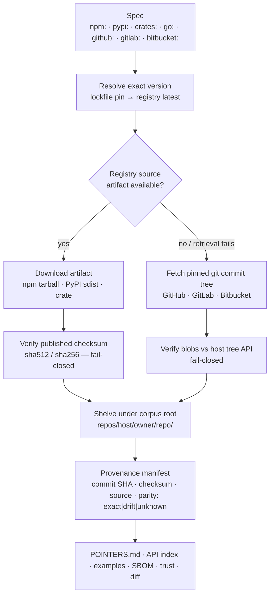
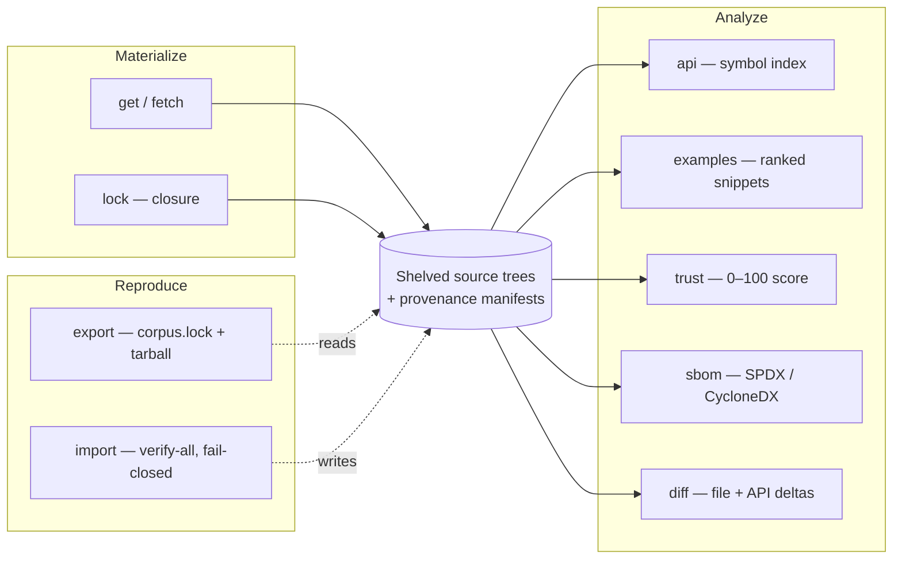
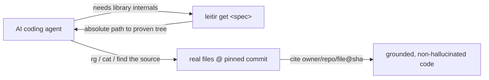

# Leitir

Leitir is a deterministic, provenance-bound dependency-source corpus plus a deterministic code-search kernel for AI coding agents.

**Status: released — [`v0.1.4`](https://github.com/anthonykewl20/leitir/releases/tag/v0.1.4)
is the first `v*` tag (2026-08-17); milestone v0.1.4 is complete and
`pyproject.toml` is 0.1.4. Production-readiness evidence is complete.**

## Why

LLM coding agents frequently hallucinate library internals, edge cases, and version-specific behavior. Public type signatures only show declarations, not control flow. Even docs can miss implementation detail, deprecated paths, and calling conventions.

Getting the right source is the hard part in a machine-safe way: which lockfile version is actually used, which commit that version refers to, whether downloaded bytes match the claim, and how to reuse the same source again offline. It also needs a reproducible citation form, not a fresh inference each run.

## How it works

Leitir treats source as the answer surface and runs a strict materialization pipeline: resolve an exact version, fetch a bounded set of candidate artifacts, verify fail-closed, shelf a provenance-rich local tree, extract analysis surfaces, and emit immutable snapshots.



## What it gives you

- Multi-host source support: GitHub, GitLab (including nested subgroup slugs), Bitbucket, Codeberg, and Sourcehut (`~user/repo`); plus package ecosystems npm, PyPI, crates.io, and Go — including non-GitHub Go modules (`gitlab.com/`, `bitbucket.org/`, `golang.org/x/`) — for lockfile-aware resolution.
- Byte-exact artifact-first fetch for registry ecosystems using published checksums, with checksum mismatch treated as fail-closed.
- Git-tree verification against host APIs for the git-commit path.
- Explicit artifact parity as `exact`, `drift`, or `unknown` recorded in manifests.
- Per-source provenance manifests with immutable commit, checksum, source type, fetch root, and resolution metadata.
- `leitir info <spec>` — one-shot agent context (provenance + API summary + top examples + trust + parity in a single JSON call).
- API surface indexes with stdlib `ast` extraction for Python, Go exported-symbol extraction, and conservative JS/TS heuristics behind a plugin hook.
- Optional hash-locked tree-sitter graph producers for JavaScript, TypeScript,
  Rust, and Go; graph production feeds BTS computation only, while relocation,
  rerun, probes, and donor-line accounting remain Python-only.
- Ranked usage-example extraction from practical entry points (`README`, `docs`, `examples`, `tests`) with symbol evidence and deterministic, evidence-backed semantic labels.
- SPDX 2.3 / CycloneDX 1.5 SBOM generation with deterministic license inference and explicit confidence.
- BTS reuse licensing uses a separate verified-byte-only, per-source REUSE 3.3
  resolver. It emits authoritative canonical `obligations.json` and derives
  `ATTRIBUTION.md` from that closed manifest; missing, ambiguous, deferred, or
  recipient-incompatible evidence fails closed.
- Deterministic trust scoring on a 0–100 scale, with factor weights (20,15,15,10,10,15,15) fixed to verification, parity, license, documentation, tests, checksum, and age (sum 100).
- Version diffing for file changes plus API-symbol changes between two resolved versions, including release-note notes when available.
- Transitive dependency closure via `leitir lock` and closure metadata in manifests.
- Immutable `export`/`import` snapshots with fail-closed rehydration checks.
- Optional, anonymous-by-default credentials: per-host tokens (GitHub/GitLab/Bitbucket incl. app-password Basic, Codeberg, Sourcehut) and registry tokens (npm/PyPI/crates) for private/authenticated access — HTTPS-only, never logged.
- Deterministic, stdlib-only code-search kernel from ADR-001.
- Deterministic ADR-0011 behavioral-transplant reference and reuse packets. V1
  uses canonical uncompressed USTAR; references are metadata-only, while reuse
  packets bind exact member, relocated source, original/rewritten test, adapter,
  probe, harness, and legal-slot payload bytes.
- Standalone ADR-002 repository self-assessment engine that drives its own
  six-dimension gate decisions without model calls; it is separate from runtime
  corpus trust scoring.
- Manifest-bound recipient project profiles with deterministic dependency and
  runtime evidence; malformed, omitted, or provenance-mismatched lockfile input
  rejects instead of falling back to ambient filesystem discovery.
- Maintainer-pinned, non-compensating BTS suitability gates: every applicable
  required gate must pass before a candidate enters comparison. ADR-0002
  `unknown`, `error`, and `skipped` outcomes remain distinct and never pass, and
  behavior proof must bind the pinned behavior-contract registry.



## Installation

```bash
# Install the released tag (v0.1.4, 2026-08-17)
pip install git+https://github.com/anthonykewl20/leitir.git@v0.1.4

# Or the latest from main
pip install git+https://github.com/anthonykewl20/leitir.git

# Then use the `leitir` command
leitir info npm:zod@3.22.0
```

Leitir is distributed via GitHub releases and tags (not PyPI). The runtime is
stdlib-only (`dependencies = []`), so no third-party runtime dependencies are
pulled in.

For optional JavaScript/TypeScript/Rust/Go graph production:

```bash
pip install 'leitir[tree-sitter]'
# Checkout/CI installs use the ADR-0012 wheel-only, hash-locked tuple:
uv pip install --require-hashes --only-binary :all: -r requirements-tree-sitter.lock
```

Behavioral-transplant donor execution is default-off and Linux-only. It requires
the exact opt-in `LEITIR_ENABLE_DONOR_EXECUTION=1` and a release-pinned external
native **nsjail** binary and policy; missing or unverifiable containment rejects,
with no portable or unsandboxed fallback. The immutable contained runner emits
a startup receipt before test discovery: it attests seccomp/no-new-privileges,
PID-namespace init, and namespace identities distinct from the launcher.
Missing or malformed receipts reject; opt-in alone is never verification.
The writable `/work` bind is measured after each run and rejects when its
policy-pinned byte or inode quota is exceeded. NsJail is not a Python
dependency. Its build script checks a committed executable SHA-256; a toolchain
drift failure must be re-measured and re-pinned by an owner in a reviewable
change, never accepted implicitly.
See [SECURITY.md](SECURITY.md) and [ADR-0009](docs/adr/0009-transplant-validation.md).

Materialized shelves can additionally require detached publisher authentication:
pass `--require-manifest-auth --trusted-keys /secure/trusted-keys.json` to
corpus-reading commands after installing the version-pinned optional extra:

```bash
pip install 'leitir[auth]'
# Hash-locked installs use the reviewed wheel-only closure:
uv pip install --require-hashes --only-binary :all: -r requirements-auth.lock
```

Unsigned, malformed, unknown-key, or invalidly signed shelves reject; this is
an optional authenticity layer, separate from tree-integrity verification.
The authentication trust-anchor surface requires a platform with no-follow-capable file reads; unsupported platforms fail closed.

Trusted-key files carry a lifecycle from schema version 2 onward
(`{"schema_version": 2, "keys": [...]}`): per-key `expires_at` and
`revoked_at` (with a required `revocation_reason`) are strict RFC-3339 UTC
timestamps enforced fail-closed at load — expired and revoked keys are
refused with distinct typed errors (`manifest_auth_key_expired_v1` /
`manifest_auth_key_revoked_v1`), retired and compromised rows stay listed as
the audit trail, and a file left with no active keys rejects outright.
Version 1 files load unchanged. Scheduled rotation (retire via `expires_at`)
and incident response (compromise via `revoked_at` + reason) are documented
as ceremonies in [ADR-0022](docs/adr/0022-trusted-key-lifecycle.md).

Relocated contract tests are rerun with the donor excluded by the read-only
filesystem mount plan, not by Python import hooks. The rerun report requires the
exact pinned canonical test-ID set, pass/fail/skip totals, and per-ID outcomes;
the runtime import recorder remains diagnostic-only. The contained interpreter
uses a sanitized environment with `PYTHONHASHSEED=0` and never uses `-I`.
File-granular rerun binds are read-only and target `/work/staging-v1`, preserving
the separately verified immutable rootfs while nsjail creates mount targets.
Donor-present baseline recording uses the same containment authority, with the
verified donor mounted read-only; there is no host-subprocess baseline fallback.

`leitir.transplant` packages only a recomputed `COMPLETE` BTS with a matching
complete validation receipt. Loading verifies the canonical USTAR representation,
logical bundle digest, receipt, and every payload digest. This is receipt
verification, not self-contained baseline-plus-rerun revalidation; optional reruns
still require the separately pinned ADR-0009 execution prerequisites. Packet hashes
provide integrity and subject binding, not publisher authenticity. License and
obligations records are the separately owned D1 policy boundary.

From a source checkout:

```bash
pip install .
# or for an editable checkout:
pip install -e .
```

### For contributors

See [CONTRIBUTING.md](CONTRIBUTING.md) for the full development setup. For quick feedback:

```bash
pip install -e '.[dev]'
PYTHONPATH=src python -m pytest -q
```

`./requirements.txt` is a pinned development/CI dependency closure, not a runtime requirement.

From a checkout where installation is unavailable, invoke commands as `PYTHONPATH=src python -m leitir.cli ...` instead.

## Quick start

```bash
# Materialize a real package and read it from the returned path
path="$(leitir get npm:zod@3.22.0)"
rg "parse" "$path"
cat "$path/package.json"

# Run search and benchmark commands
leitir search --package zod --version 3.22.0 --ecosystem npm --must symbol_definition:parse
leitir index
leitir search --package zod --version 3.22.0 --ecosystem npm --must exact_text:parse --index
leitir bench

# Replay a recorded capability funnel and inspect its canonical decision summary
leitir bts-funnel --spec capability.json --recipient-manifest recipient.json --stages stages.json --json

# Run a pinned BTS pipeline only with explicit containment identity pins
leitir bts-run owner/repo@<40-char-sha> --root "$LEITIR_HOME" --seed-module pkg.mod \
  --seed-name symbol --contract-spec contracts.json --recipient-package recipient --out out/ \
  --nsjail-sha256 sha256:<hex> --nsjail-version '<version>' --nsjail-build-identity sha256:<hex> \
  --config-schema-digest sha256:<hex> --rootfs-source /pinned/rootfs --rootfs-digest sha256:<hex>

# Validate or run the pinned five-donor exit corpus (runtime substrate pins are mandatory)
# Requires a source checkout: the corpus path below is checkout-relative.
leitir exit-gate-validate benchmarks/exit-corpus/corpus-v1.1.json --json
leitir exit-gate-run benchmarks/exit-corpus/corpus-v1.1.json --corpus-root benchmarks/exit-corpus \
  --substrate-nsjail-sha sha256:<hex> --substrate-rootfs-digest sha256:<hex> \
  --nsjail-version '<version>' --nsjail-build-identity sha256:<hex> \
  --config-schema-digest sha256:<hex> --rootfs-source /prepared/rootfs --json

# Inspect the published six-task BTS benchmark plan without executing donors
# Requires a source checkout: tools/run_bts_tasks.py is not installed with Leitir.
PYTHONPATH=src python tools/run_bts_tasks.py --dry-run
```

### Credentials and corpus root

GitHub API/search commands accept `GH_TOKEN` first, then `GITHUB_TOKEN`; values
are never printed. Other optional provider tokens remain environment-backed as
documented by `leitir doctor`. The corpus root is `LEITIR_HOME` when set and
otherwise defaults to `~/.leitir`.

### `bts-funnel` inputs

`bts-funnel` reads three JSON inputs: a canonical capability spec
(`{"schema_version":"leitir-capability-v1",...}`), a recipient manifest
(`{"schema_version":"leitir-funnel-recipient-input-v1","project_root_identity":"...","entries":[...]}`),
and a closed stages array
(`[{"search_spec_digest":"...","report":{...},"symbols":[...],"termination":"clean_eof","pages_recorded":1,"blob_byte_lengths":[1]}]`).

## The agent workflow (required)

Before writing behavior against a library/framework, run `leitir info <spec>` and synthesize from its extracted public signatures, docstrings, and top usage code with provenance. Do not hand-roll behavior the source already defines. Read full files only for behavior beyond that surface: fetch missing sources with `leitir get <spec>`, read `POINTERS.md` and files (`rg`, `cat`, `find`), and cite used files as `<owner>/<repo>/<file>@<commit-SHA>` using the manifest commit SHA.



## Commands

### Search and benchmark
- `search`: resolve spec+predicate scope and return provenance-bound results; scoped search serves matching verified local shelves without per-file API fetches.
- `index [scope ...] [--root ROOT|--local]`: explicitly build deterministic local
   trigram indexes for eligible materialized shelves. A shelf is eligible only with
   `source=git-commit`, `parity=exact`, and a full materialized-tree hash.
   Ineligible shelves are reported by shelf identity and failed `source`, `parity`,
   or `scope` condition in stderr and `skipped_ineligible` JSON; eligible shelves
   still index. The command exits 0 only when at least one eligible shelf indexed
   and no hard error occurred; when every candidate shelf is skipped as
   ineligible it prints a named `nothing to index` message and exits with the
   dedicated status 4 (`NOTHING_INDEXED`) instead of the generic failure 1,
   so callers can distinguish "nothing eligible" from corruption or hard errors.
  `search --index` reports uncovered fallback scopes as partial;
  `search --require-index` rejects them. Search never builds or repairs an index.
  Export/import excludes index artifacts and `gc` preserves them.
- `bench`: run the pinned `search-v1` benchmark with fixed tasks and strict output shape.

### Diagnostics
- `doctor [--json] [--quiet] [--no-network]`: check the Python/install environment,
  internal imports, corpus filesystem capabilities, cache manifests and integrity,
  credential formatting, service reachability, and release availability. It returns
  0 when healthy, 1 for warnings, and 2 for errors; credential values are never shown.

### Corpus
- `get`: materialize sources and print absolute local path(s).
- `fetch`: prefetch materialized sources without printing paths.
- `list [--require-manifest-auth]`: show current corpus entries and trust/verification state; with the flag, unsigned or untrusted shelves fail closed instead of being listed.
- `remove`: delete a shelved source entry.
- `clean`: clear corpus metadata and cached materialization.
- `gc`: remove abandoned repository staging and obsolete backups under target locks;
  a sole `.old-` generation is left in place when its target is absent.

### Analysis
- `info`: one-shot agent context with provenance, bounded public signatures and docstrings, top usage code, trust, and parity. Use this first.
- `api`: extract, cache, and return a bounded public-symbol contract with signatures, docstrings, and provenance.
- `examples`: extract and rank usage snippets for that source.
- `trust`: compute cached trust score and factor breakdown.
- `sbom`: emit SPDX 2.3 or CycloneDX 1.5 SBOM artifacts from the corpus.
- `diff`: compare two resolved versions with file and API-symbol deltas.
- `bts-compute owner/repo@commit --root ROOT --seed-module MODULE --seed-name NAME --out DIR [--policy POLICY.json]`: compute BTS graph and summary artifacts from one verified exact shelf; for example, `leitir bts-compute acme/widget@0123456789abcdef0123456789abcdef01234567 --root .leitir --seed-module widget.api --seed-name widget.api.run --out bts-out --json`. `--list-seeds` instead lists selectable donor definition seeds and cannot be combined with seed or output arguments. Without `--allow-reject`, a written REJECT result exits nonzero; `--allow-reject` retains the artifact but exits successfully. Without `--policy`, it uses a pinned empty resolution policy, so donors that reach stdlib or external interfaces will normally not be COMPLETE. A policy is closed-schema JSON: `{"schema_version":"leitir-bts-cli-policy-v1","stdlib_modules":[...],"adapters":[{"module":"...","disposition":"adapter"|"pinned-exact"}]}`; arrays must be sorted and unique.
- `occupied-validate artifact.json`: validate a canonical occupied-recipient attachment artifact offline. A committed, self-validating example lives at `tests/fixtures/occupied_validate/example-artifact.json` (regenerate deterministically with `PYTHONPATH=src python tests/fixtures/occupied_validate/generate.py`); for example, `leitir occupied-validate tests/fixtures/occupied_validate/example-artifact.json --json`.
- `analysis-architecture graph.json --subject SUBJECT [--catalog CATALOG]`: assess a canonical graph with a non-empty slug-like caller label (`letters`, digits, `-`, `_`, `.`); JSON labels it `caller-declared-label`, not derived authority. For example, `leitir analysis-architecture graph.json --subject widget --json`.
- `analysis-lineage manifest.json`: validate a canonical lineage manifest; for example, `leitir analysis-lineage lineage.json --json`.
- `exit-gate-validate corpus.json`: validate pinned exit-corpus evidence and its standalone gate cross-check. `ratified_manifest_digest` is record-level content binding; `ratified_runtime_digest` is the separate out-of-band authority value consumed only by `exit-gate-run`.

### Closure and reproducibility
- `lock`: materialize the project's transitive dependency closure.
- `export`: write a v2 `corpus.lock` plus compressed snapshot and emit the lock digest.
- `import`: verify and rehydrate a v2 snapshot into an empty destination; the trusted
  `--lock-sha256` is mandatory. Existing v1 snapshots must be re-exported.

#### Screenshots

Real captures, run against live sources.

```bash
$ leitir get npm:is-number@7.0.0
~/.leitir/repos/github.com/jonschlinkert/is-number/98e8ff1da1a89f93d1397a24d7413ed15421c139
leitir: resolving npm:is-number@7.0.0
leitir: materializing npm:is-number@7.0.0

$ leitir list
markdown-it-py 3.0.0 executablebooks/markdown-it-py@bee6d1953be75717a3f2f6a917da6f464bed421d verified trust=unknown
is-number      7.0.0 jonschlinkert/is-number@98e8ff1da1a89f93d1397a24d7413ed15421c139        verified trust=unknown
octocat/Hello-World … @7fd1a60b01f91b314f59955a4e4d4e80d8edf11d                                verified trust=unknown

$ leitir trust npm:is-number@7.0.0
is-number trust=56
  age:               50/100  weight=15   (unknown — no cached release/commit timestamp)
  artifact_checksum: 100/100 weight=15   (present — npm-tarball)
  documentation:     100/100 weight=10   (docs + entry points)
  license:           25/100  weight=15   (low confidence)
  parity:             0/100  weight=15   (drift — artifact vs git tree)
  tests:              0/100  weight=10   (absent — no tests/ in git tree)
  verification:      100/100 weight=20   (verified=True)
```

```bash
$ leitir diff npm:is-number@6.0.0 npm:is-number@7.0.0
Added files (0):
Removed files (0):
Modified files (4):
  LICENSE
  README.md
  index.js
  package.json
Added symbols (0):
Removed symbols (0):
Changed signatures (0):
```

Diff report identities describe the bytes actually diffed, not the state of a
moving ref. `identity.commit_sha` reports the commit SHA pinned to the
materialized shelf — the corpus sources index entry pin first, then the shelf
manifest pin, else the scope that fed the materializer in the same call — and
a re-resolved moving head (a branch or tag that advanced mid-run) never
overwrites the reported pin.

```bash
$ leitir api pypi:markdown-it-py@3.0.0
~/.leitir/api/pypi/markdown-it-py/3.0.0/index.json
  → 223 symbols extracted (method: ast)
    e.g. function markdown_it._punycode.decode
         function markdown_it._punycode.encode
```

```bash
$ leitir sbom --format cyclonedx | jq '.components[0]'
{
  "type": "library",
  "name": "octocat/Hello-World",
  "version": "7fd1a60b01f91b314f59955a4e4d4e80d8edf11d",
  "licenses": [],
  "properties": [
    { "name": "leitir:license_method",   "value": "unknown" },
    { "name": "leitir:license_confidence","value": "low" },
    { "name": "leitir:source",            "value": "git-commit" },
    { "name": "leitir:parity",            "value": "unknown" }
  ]
}
```

Paths shown are under the corpus root (for example `~/.leitir/...` or project-local `./.leitir-refs/...`). Commands that *write* to a project-local corpus append `.leitir-refs/` to the project `.gitignore` (announcing it once); read-only commands against an uncovered project-local root never modify `.gitignore` and instead print a note that the directory is not covered.

## Honesty guarantees

- **Manifest authenticity is opt-in.** By default, Leitir verifies content
  integrity and subject binding only; it does not authenticate a repository owner
  or publisher. `--require-manifest-auth` requires the separately installed,
  hash-locked `auth` extra and an explicitly configured out-of-band trust root,
  and fails closed rather than accepting unsigned or untrusted manifests. The
  flag is enforced on every shelf-consuming command (`get`, `fetch`, `info`,
  `diff`, `api`, `examples`, `list`, `trust`, `sbom`, `export`, `index`,
  `bts-compute`, `bts-run`); corpus-wide commands verify *every* shelved source before
  producing output, so a signed-shelves-only policy has no unauthenticated
  read path. In unsigned mode the boundary is: file *contents* remain
  tamper-evident via load-time tree verification, but displayed metadata
  (`registry_url`, names, trust fields, and other manifest strings not covered
  by `materialized_tree_hash`) can be edited undetected by whoever controls the
  local storage — do not treat unsigned-mode metadata displays as
  tamper-evident.
- **Registry-only degraded resolution is announced, never silent.** When a
  PyPI/npm tag-to-commit lookup fails for a transport reason (throttle, outage)
  while the registry artifact is reachable and checksum-verified, resolution
  succeeds registry-only: the shelf identity is the deterministic
  `registry/<name>` scope (never a git commit), the manifest records
  `degraded_provenance` with `parity: unknown`, and the CLI prints a warning
  before materializing (ADR-0023). A provably absent repository or tag
  (`TagAbsentError`) still fails closed, as does a package without a
  checksummed artifact.
- Offline exact pins (#245, ADR-0024): once a `pypi`/`npm`/`crates`
  name+version pin is shelved, `get`/`info`/`api`/`examples`/`diff`
  resolve it local-first from the load-time-verified shelf — no
  registry contact. The cached resolution is announced (`resolved
  offline from the corpus index`), degraded shelves still warn, a
  tampered shelf is skipped (fail-closed offline, self-heals online),
  and floating/`latest` specs still require the live registry.
- Provenance-bound corpus outputs resolve to immutable provenance and source-specific manifests. Verified corpus shelves are re-hashed against `materialized_tree_hash` on every load; unverified shelves may omit the digest. Global search results are not necessarily materialized shelves.
- Full-coverage load-time verification (since #194): every newly materialized manifest carries `materialized_file_digests`, a flat per-file SHA-256 map (Cargo-checksum style). At load, every file's digest is verified in one streaming pass and the map is checked against the anchored full-scope `materialized_tree_hash`, so corruption of *any* file — including files outside the legacy sampled window on shelves above the verification caps — is detected and rejected with a typed error naming the path. The caps now bound only ingest-time sampling heuristics, never the load-time trust level; `sampled` survives solely as an ingest-time cross-check label.
- Fail-closed verification: checksum or tree mismatches remove or reject materialization and never create a trusted cache entry. Archive symlink chains are resolved lexically before extraction, so confinement does not depend on host symlink behavior.
- Legacy verified caches require `leitir upgrade-cache` to add a materialized-tree digest and gain load-time verification; until upgraded they are rejected as cache misses. Legacy shelves load via the existing aggregate path with their honest stored scope (a sampled shelf stays labeled sampled until re-materialized).
- Runtime `leitir trust` turns unknown factors into neutral numeric scores (50/100), rather than `indeterminate`. Only the ADR-002 repository assessment gate preserves `indeterminate` as a decision.
- Trust evidence is never fabricated: age requires a real source timestamp, missing
  license evidence is neutral (50), and legacy manifests without `has_tests` treat
  tests as unknown until `upgrade-cache` or re-materialization refreshes evidence.
- Deterministic behavior: stable outputs for fixed inputs and hash-safe operation independent of interpreter hash order.
- Local trigram candidates are only a reduction step: the original predicates still
  run against source bytes while the materialization lock is held. Missing, stale,
  malformed, sampled, drifted, or schema-incompatible index shelves cannot produce
  complete indexed coverage.
- Stdlib-only runtime: core operations do not require external Python dependencies, model calls, or credentials.
- BTS validation requires an explicit maintainer-reviewed, content-pinned probe set over every applicable `TESTED_BY` edge. Each probe runs in a fresh donor-absent contained child; probe failures and observed donor imports reject independently. V1 never generates semantic probes autonomously.
- Optional host tokens are read from environment, used only on HTTPS, never logged, and global discovery remains `INDETERMINATE`, never exhaustive.
- Global discovery pins every result to the immutable commit SHA exposed by the search index, verifies fetched bytes at that commit against the indexed git blob SHA, and records an `indexed_commit` resolution strategy and UTC `as_of` time. Its report validator requires verified source line counts whenever matches are present, so omitted bounds data and spans beyond the verified bytes are rejected fail-closed. It paginates with a fixed cap and reports pin, fetch, decode, provenance, adapter, and duplicate exclusions. Duplicate candidates are collapsed from repeated repository paths and then the index's claimed blob SHA; only the elected representative (or a deterministic promoted replacement after failure) is fetched, so `deduplicated` does not claim byte verification of members that remain collapsed. The `max_results` budget bounds fetch attempts, including promoted retries within a collapsed content group. Verification failures can therefore produce an honestly incomplete report that does not include every distinct candidate.
- Global discovery rejects unsupported must predicates such as REGEX. Structural and
  PATH predicates use GitHub only as a candidate superset and are locally re-verified.
- Irreducible limit: a remote search index is not itself a pinned input. Two live runs at different wall-clock times may see an advancing index, server-side ranking changes, or different `incomplete_results`; reproducibility holds for the recorded pinned hit set, not for re-querying the live index.

## Update notifications

When run interactively (TTY stdout + stderr, not in CI, not in `--json` mode), leitir
makes at most one anonymous GET request per 24 hours to GitHub's Releases API
(`https://api.github.com/repos/anthonykewl20/leitir/releases/latest`) to check for a
newer release. The `User-Agent` is `leitir/<version> update-check`; the request contains
no username, repository path, project data, command arguments, or telemetry. Set
`LEITIR_NO_UPDATE_CHECK=1` to disable.

## Scoring

`tools/score_engine.py` is the ADR-002 repository/engine assessment scorer. It evaluates the Leitir project itself—code health, test adequacy, supply chain, and related evidence—across six weighted dimensions. It does **not** implement, mirror, or independently verify the runtime `leitir trust` seven-factor corpus-trust model in `src/leitir/trust.py`. The two systems assess different subjects and share only the abstract principle that “unknown is neither zero nor pass.” The published pinned assessment reports `decision=pass`, `complete=true`. Details, exact scores, and subject identity are tracked in [docs/scoring.md](docs/scoring.md).

## Tests

```bash
PYTHONPATH=src uv run --no-project --with-requirements requirements.txt python -m pytest
```

Offline is default. Live network checks are opt-in behind `LEITIR_ENABLE_LIVE_E2E=1`. Current status (2026-08-24): **3187 passed, 142 skipped** without extras; **3237 passed, 92 skipped** with the tree-sitter extra active; combined line+branch coverage **83.48%** against the refreshed baseline in `.github/workflows/coverage-baseline.json` (floor 81.0%, per-module minimums carry 0.15% drift headroom).

## Current state

- Production-readiness gate #42 has recorded dogfood and 116-package load-test
  evidence. Two independent security reviews recorded no P0/P1 findings; PR #166
  remediated the reported P2 findings.
- The contained Phase-A exit corpus has repeatedly completed all five donors
  (each 2/0/0). Its most recent honest run,
  [31967278924](https://github.com/anthonykewl20/leitir/actions/runs/31967278924),
  rejects solely because runtime ratification is deliberately pending: the
  run-to-run drift of the donor mount-source tree digest is removed by the
  manifest-free donor mount projection of ADR-0021, so the runtime digest is
  now a pure function of pinned inputs and awaits a fresh owner measurement
  and signature. The published `containment-rootfs-v1` asset is pinned to
  `sha256:ec28886a5e448e9d6b088470c85ee2e0d170e16002bd78ecc835e9d4161155ac`.
  The next owner step is re-measuring the stabilized runtime digest, followed
  by a fresh signature.
- BTS benchmark evidence is published at
  `benchmarks/bts-v1/runs/88330e29d91e5aa6786be3079f79357a7df5e0583832487765d84c2991747860/`:
  five of six tasks have exact baselines and metrics; the
  `worker-shutdown-predicate` result is an honest partial caused by the pinned
  `bts_cli_parity_v1` provenance mismatch. The E5b timing envelope remains
  intentionally deferred offline.
- The credential-gated live provider canary is enabled on its daily schedule.
  Its main-branch probes are green; three v2 probes intentionally skip because
  their test files have not landed.
- **Local-verification boundary (2026-08-23 audit):** the full contained
  donor-execution pipeline (`bts-run` under nsjail) was *not* re-executed
  locally for this audit round; its acceptance evidence remains the milestone
  Phase-C exit-gate runs — branch
  [32018653190](https://github.com/anthonykewl20/leitir/actions/runs/32018653190)
  and canonical main
  [32018948262](https://github.com/anthonykewl20/leitir/actions/runs/32018948262)
  — which completed 5/5 donors against the ratified runtime digest
  (`sha256:72949674…`, owner key `7baec2e9…`, ceremony recorded in
  `benchmarks/exit-corpus/ratification-v1.json`). Likewise, `--global`
  code-search result-capping behavior is covered by offline tests for every
  bound code (`tests/test_discovery_search_capping.py`), but no live
  rate-limited index was driven to produce a capped report this round; live
  evidence remains the daily canary. No new local coverage is claimed for
  either area beyond what is cited here.

## Repository layout

- `src/leitir/` — kernel and corpus implementation: `resolver`, `materialize`, `parity`, `snapshot`, `sbom`, `apisurface`, `examples`, `diff`, `trust`, `lockfiles`, `cli`, plus search, ranking, benchmark, composition, architecture, duplicates, lineage, cost, occupied, and optional polyglot graph code.
- `src/leitir/benchmarks/search-v1/` — deterministic ranked-search benchmark manifest.
- `src/leitir/benchmarks/corpus-v1/` — corpus fetch-correctness benchmark manifest.
- `tools/score_engine.py` — standalone ADR-002 scorer.
- `scorecard/` — policy, assessment schema, and published canonical outputs.
- `skills/leitir/SKILL.md` — normative corpus workflow for AI coding agents.
- `docs/` — ADRs, status, scoring docs, and historical notes.
- `tests/` — offline suite with opt-in live gates and fixtures.
- `requirements.txt` — pinned development/CI dependency closure, not a runtime requirement.
- `requirements-tree-sitter.lock` — wheel-only, hash-locked optional tree-sitter tuple from ADR-0012.

## Documentation

- [Architecture Decision Records](docs/adr/README.md)
- [docs/STATUS.md](docs/STATUS.md)
- [docs/scoring.md](docs/scoring.md)
- [skills/leitir/SKILL.md](skills/leitir/SKILL.md)

Historical, retired v1 references: [docs/PRD.md](docs/PRD.md), [docs/operations.md](docs/operations.md), [docs/smoke-evaluation.md](docs/smoke-evaluation.md), plus the manual v1 scorecards — [docs/leitir-engine-scorecard.html](docs/leitir-engine-scorecard.html), its [historical PNG snapshot](docs/leitir-engine-scorecard.png), and the manual [v2 editorial scorecard](docs/leitir-engine-scorecard-v2.html). These manual
snapshots are never scorer evidence.
