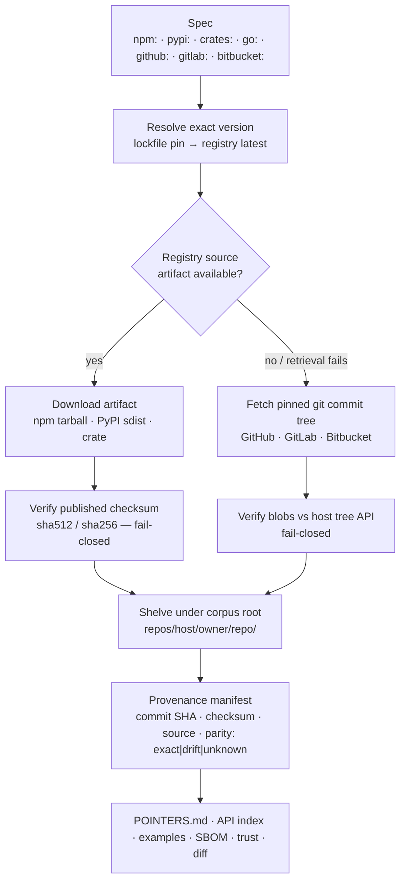
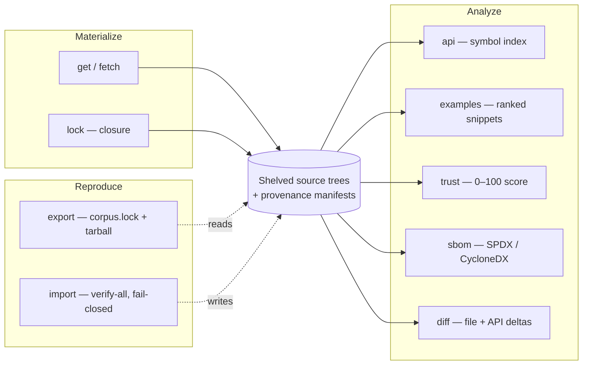
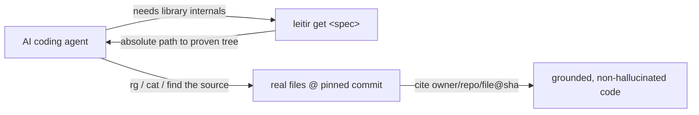

# Leitir

Leitir is a deterministic, provenance-bound dependency-source corpus plus a deterministic code-search kernel for AI coding agents.

**Status: implementation-complete; design-stage software. Not production-ready.**

## Why

LLM coding agents frequently hallucinate library internals, edge cases, and version-specific behavior. Public type signatures only show declarations, not control flow. Even docs can miss implementation detail, deprecated paths, and calling conventions.

Getting the right source is the hard part in a machine-safe way: which lockfile version is actually used, which commit that version refers to, whether downloaded bytes match the claim, and how to reuse the same source again offline. It also needs a reproducible citation form, not a fresh inference each run.

## How it works

Leitir treats source as the answer surface and runs a strict materialization pipeline: resolve an exact version, fetch a bounded set of candidate artifacts, verify fail-closed, shelf a provenance-rich local tree, extract analysis surfaces, and emit immutable snapshots.



## What it gives you

- Multi-host source support: GitHub, GitLab (including nested subgroup slugs), Bitbucket, Codeberg, and Sourcehut (`~user/repo`); plus package ecosystems npm, PyPI, crates.io, and Go — including non-GitHub Go modules (`gitlab.com/`, `bitbucket.org/`, `golang.org/x/`) — for lockfile-aware resolution.
- Byte-exact artifact-first fetch for registry ecosystems using published checksums, with checksum mismatch treated as fail-closed.
- Git-tree verification against host APIs for the git-commit path.
- Explicit artifact parity as `exact`, `drift`, or `unknown` recorded in manifests.
- Per-source provenance manifests with immutable commit, checksum, source type, fetch root, and resolution metadata.
- `leitir info <spec>` — one-shot agent context (provenance + API summary + top examples + trust + parity in a single JSON call).
- API surface indexes with stdlib `ast` extraction for Python and conservative JS/TS heuristics behind a plugin hook.
- Ranked usage-example extraction from practical entry points (`README`, `docs`, `examples`, `tests`) with symbol evidence.
- SPDX 2.3 / CycloneDX 1.5 SBOM generation with deterministic license inference and explicit confidence.
- Deterministic trust scoring on a 0–100 scale, with factor weights (20,15,15,10,10,15,15) fixed to verification, parity, license, documentation, tests, checksum, and age (sum 100).
- Version diffing for file changes plus API-symbol changes between two resolved versions, including release-note notes when available.
- Transitive dependency closure via `leitir lock` and closure metadata in manifests.
- Immutable `export`/`import` snapshots with fail-closed rehydration checks.
- Optional, anonymous-by-default credentials: per-host tokens (GitHub/GitLab/Bitbucket incl. app-password Basic, Codeberg, Sourcehut) and registry tokens (npm/PyPI/crates) for private/authenticated access — HTTPS-only, never logged.
- Deterministic, stdlib-only code-search kernel from ADR-001.
- Standalone evidence-scoring engine from ADR-002 that drives gate decisions without model calls.



## Quick start

```bash
# Optional: install the `leitir` console script (the screenshots below use it).
# Without installing, invoke every command as `python -m leitir.cli ...`.
python -m pip install -e .

# Materialize a real package and read it from the returned path
path="$(PYTHONPATH=src python -m leitir.cli get npm:zod@3.22.0)"
rg "parse" "$path"
cat "$path/package.json"

# Run search and benchmark commands
PYTHONPATH=src python -m leitir.cli search --package zod --version 3.22.0 --ecosystem npm --must symbol_definition:parse
PYTHONPATH=src python -m leitir.cli bench
```

## The agent workflow (required)

Before writing behavior against a library/framework, run `leitir info <spec>` and synthesize from its extracted public signatures, docstrings, and top usage code with provenance. Do not hand-roll behavior the source already defines. Read full files only for behavior beyond that surface: fetch missing sources with `leitir get <spec>`, read `POINTERS.md` and files (`rg`, `cat`, `find`), and cite used files as `<owner>/<repo>/<file>@<commit-SHA>` using the manifest commit SHA.



## Commands

### Search and benchmark
- `search`: resolve spec+predicate scope and return provenance-bound results.
- `bench`: run the pinned `search-v1` benchmark with fixed tasks and strict output shape.

### Corpus
- `get`: materialize sources and print absolute local path(s).
- `fetch`: prefetch materialized sources without printing paths.
- `list`: show current corpus entries and trust/verification state.
- `remove`: delete a shelved source entry.
- `clean`: clear corpus metadata and cached materialization.

### Analysis
- `info`: one-shot agent context with provenance, bounded public signatures and docstrings, top usage code, trust, and parity. Use this first.
- `api`: extract, cache, and return a bounded public-symbol contract with signatures, docstrings, and provenance.
- `examples`: extract and rank usage snippets for that source.
- `trust`: compute cached trust score and factor breakdown.
- `sbom`: emit SPDX 2.3 or CycloneDX 1.5 SBOM artifacts from the corpus.
- `diff`: compare two resolved versions with file and API-symbol deltas.

### Closure and reproducibility
- `lock`: materialize the project's transitive dependency closure.
- `export`: write immutable `corpus.lock` plus compressed corpus snapshot tarball.
- `import`: verify and rehydrate a snapshot into an empty destination, fail-closed.

#### Screenshots

Real captures, run against live sources.

```bash
$ leitir get npm:is-number@7.0.0
~/.leitir/repos/github.com/jonschlinkert/is-number/98e8ff1da1a89f93d1397a24d7413ed15421c139
leitir: resolving npm:is-number@7.0.0
leitir: materializing npm:is-number@7.0.0

$ leitir list
markdown-it-py 3.0.0 executablebooks/markdown-it-py@bee6d1953be75717a3f2f6a917da6f464bed421d verified trust=unknown
is-number      7.0.0 jonschlinkert/is-number@98e8ff1da1a89f93d1397a24d7413ed15421c139        verified trust=unknown
octocat/Hello-World … @7fd1a60b01f91b314f59955a4e4d4e80d8edf11d                                verified trust=unknown

$ leitir trust npm:is-number@7.0.0
is-number trust=56
  age:               50/100  weight=15   (unknown — no cached release/commit timestamp)
  artifact_checksum: 100/100 weight=15   (present — npm-tarball)
  documentation:     100/100 weight=10   (docs + entry points)
  license:           25/100  weight=15   (low confidence)
  parity:             0/100  weight=15   (drift — artifact vs git tree)
  tests:              0/100  weight=10   (absent — no tests/ in git tree)
  verification:      100/100 weight=20   (verified=True)
```

```bash
$ leitir diff npm:is-number@6.0.0 npm:is-number@7.0.0
Added files (0):
Removed files (0):
Modified files (4):
  LICENSE
  README.md
  index.js
  package.json
Added symbols (0):
Removed symbols (0):
Changed signatures (0):
```

```bash
$ leitir api pypi:markdown-it-py@3.0.0
~/.leitir/api/pypi/markdown-it-py/3.0.0/index.json
  → 223 symbols extracted (method: ast)
    e.g. function markdown_it._punycode.decode
         function markdown_it._punycode.encode
```

```bash
$ leitir sbom --format cyclonedx | jq '.components[0]'
{
  "type": "library",
  "name": "octocat/Hello-World",
  "version": "7fd1a60b01f91b314f59955a4e4d4e80d8edf11d",
  "licenses": [],
  "properties": [
    { "name": "leitir:license_method",   "value": "unknown" },
    { "name": "leitir:license_confidence","value": "low" },
    { "name": "leitir:source",            "value": "git-commit" },
    { "name": "leitir:parity",            "value": "unknown" }
  ]
}
```

Paths shown are under the corpus root (for example `~/.leitir/...` or project-local `./.leitir-refs/...`).

## Honesty guarantees

- Provenance-bound outputs: every visible item resolves to an immutable commit and checksum, derives from the source-specific manifest, and has its materialized tree digest verified again at load time.
- Fail-closed verification: checksum or tree mismatches remove or reject materialization and never create a trusted cache entry.
- Legacy verified caches require `leitir upgrade-cache` to add a materialized-tree digest and gain load-time verification; until upgraded they are rejected as cache misses.
- `unknown` evidence never becomes zero or a pass; unresolved checks preserve indeterminate state.
- Deterministic behavior: stable outputs for fixed inputs and hash-safe operation independent of interpreter hash order.
- Stdlib-only runtime: core operations do not require external Python dependencies, model calls, or credentials.
- Optional host tokens are read from environment, used only on HTTPS, never logged, and global discovery remains `INDETERMINATE`, never exhaustive.

## Scoring

`tools/score_engine.py` is the ADR-002 standalone scoring engine. It is separate from runtime CLI paths, imports no `leitir` package code, makes no model calls, and applies the ADR-002 rule that unknown is neither zero nor pass. It still reports this repository as an honest no-pass/indeterminate outcome today because required evidence is incomplete, with the details and current result tracked in [docs/scoring.md](docs/scoring.md).

## Tests

```bash
PYTHONPATH=src uv run --no-project --with-requirements requirements.txt python -m pytest
```

Offline is default. Live network checks are opt-in behind `LEITIR_ENABLE_LIVE_E2E=1`. Current status: **1035 passed, 48 skipped**.

## Repository layout

- `src/leitir/` — kernel and corpus implementation: `resolver`, `materialize`, `parity`, `snapshot`, `sbom`, `apisurface`, `examples`, `diff`, `trust`, `lockfiles`, `cli`, plus search, ranking, and benchmark code.
- `src/leitir/benchmarks/search-v1/` — deterministic ranked-search benchmark manifest.
- `src/leitir/benchmarks/corpus-v1/` — corpus fetch-correctness benchmark manifest.
- `tools/score_engine.py` — standalone ADR-002 scorer.
- `scorecard/` — policy, assessment schema, and published canonical outputs.
- `skills/leitir/SKILL.md` — normative corpus workflow for AI coding agents.
- `docs/` — ADRs, status, scoring docs, and historical notes.
- `tests/` — offline suite with opt-in live gates and fixtures.
- `requirements.txt` — runtime/test dependency lock.

## Documentation

- ADRs: [001](docs/adr-001-remove-hy3-deterministic-search.md), [002](docs/adr-002-deterministic-evidence-scoring-engine.md), [003](docs/adr-003-categorized-http-retry.md), [004](docs/adr-004-local-source-materialization.md), [005](docs/adr-005-corpus-v2-capabilities.md), [006](docs/adr-006-load-time-tree-verification.md)
- [docs/STATUS.md](docs/STATUS.md)
- [docs/scoring.md](docs/scoring.md)
- [skills/leitir/SKILL.md](skills/leitir/SKILL.md)

Historical, retired v1 references: [docs/PRD.md](docs/PRD.md), [docs/operations.md](docs/operations.md), [docs/smoke-evaluation.md](docs/smoke-evaluation.md), plus the manual v1 scorecards — [docs/leitir-engine-scorecard.html](docs/leitir-engine-scorecard.html), its [historical PNG snapshot](docs/leitir-engine-scorecard.png), and the manual [v2 editorial scorecard](docs/leitir-engine-scorecard-v2.html). These manual
snapshots are never scorer evidence.
